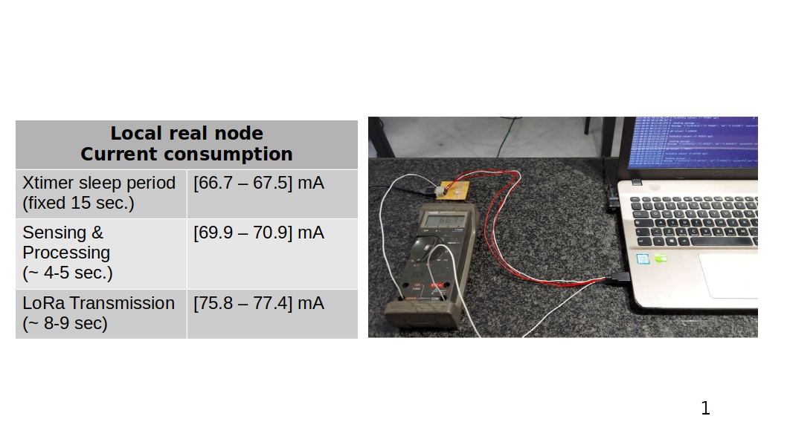
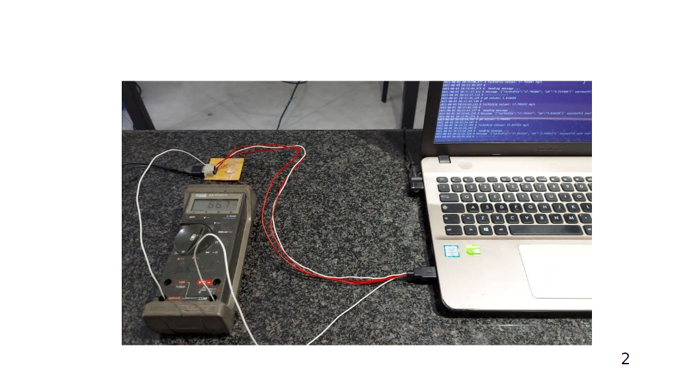
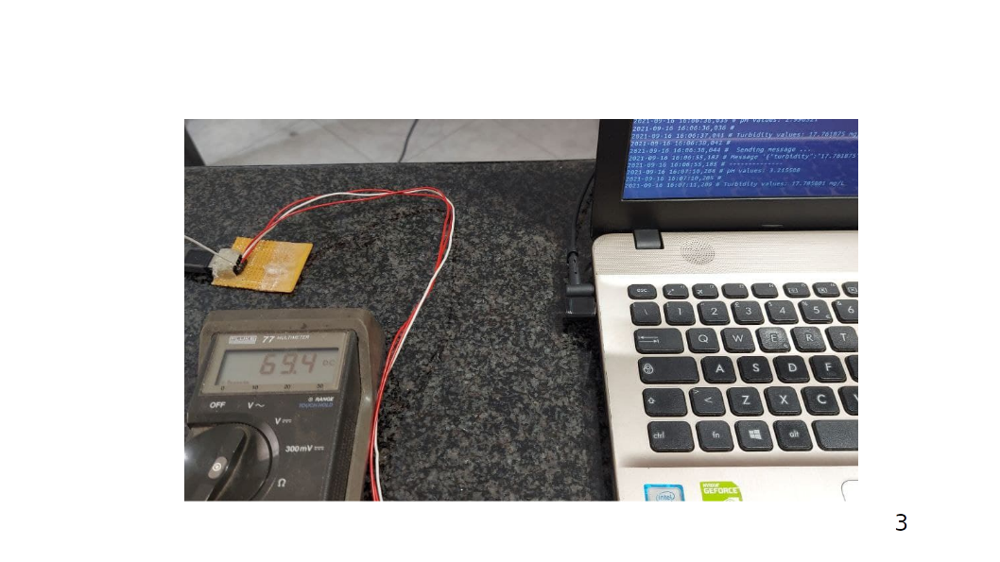
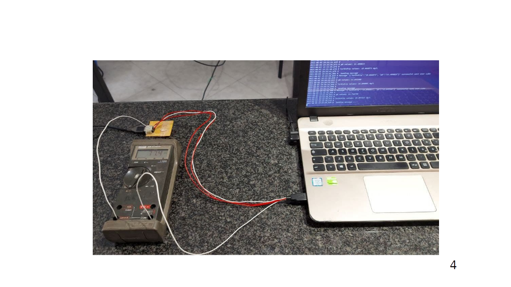
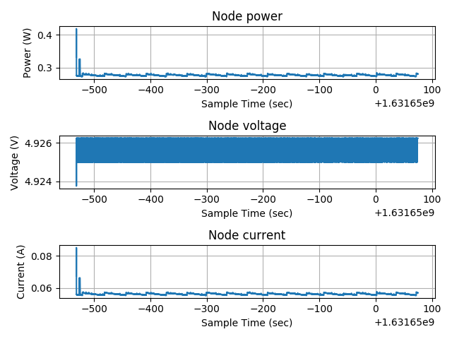
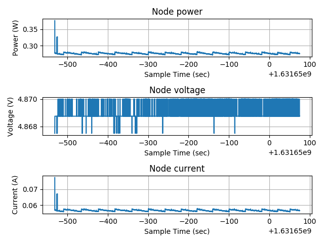

# HarbourWasteControl IoT 2021 - Evaluation
The aim of this document is to describe HarbourWasteControl's performance in term of the different paramenters listed below. 
These paramenters come from the recommendations provided during the [IoT 2021 course 10589747](http://ichatz.me/Site/InternetOfThings2021), in particular from:
* Lecture 9 - UI/UX for IoT - [Prof. Ioannis Chatzigiannakis](https://github.com/ichatz)
* Lecture 11 - Performance Evaluation for IoT - [Prof. Andrea Vitaletti](https://github.com/andreavitaletti).
* Lecture 13 - LoRa networks - [Prof. Ioannis Chatzigiannakis](https://github.com/ichatz)
 
The following evaluation concerns both the one perfomed during the development phase and the one undertaken at the end of the project. Furthermore the evaluation is conducted at two different places:
* (Locally) Real local node [ST B-L072Z-LRWAN1](https://www.st.com/en/evaluation-tools/b-l072z-lrwan1.html) ```st-lrwan1-local```, which makes use of LoRa modules and Turbidity and pH sensors
* (Remotely) FIT IoT-LAB Testbed, which provide #25 [ST B-L072Z-LRWAN1](https://www.iot-lab.info/docs/boards/st-b-l072z-lrwan1/) ```st-lrwan1-1```-```st-lrwan1-25```, to perform large-scale evaluations
  * **NOTE** Because of the use of a remote testbed, it is not possible to connect intended sensors physically, pH sensor and Turbidity ones, in remote boards. There is no possibility to get real data from the sensors and so no pH alteration and Tubidity variations occurs (like conversely they happen in ```st-lrwan1-local```). 
  * To deal with this problem we have followed **Dataset traces** approach proposed throughout Lecture 11. In particular remote boards rely on [The Water Quality dataset](https://www.kaggle.com/adityakadiwal/water-potability) by Kaggle.com - Aditya Kadiwal. It is a CSV dataset containing water quality metrics for **3276 different water bodies**, in particular remote boards retrieve the two desired values from the dataset locally. In this way it possible to **simulate** behaviour of pH and Turbidity sensor with actual data as they were physically connected


The evaluation of each paramenter includes:
* Explanation of the evaluation methodology, 
* List of the key performance indicators 
* Indication of the tool used to analyse the specified indicators
* Results

## Index
1. [User eXperience and satisfaction](#1-user-experience-and-satisfaction)
2. [Power consumption](#2-power-consumption)
3. [Network technology assessment/Network performace](#3-network-technology-assessment)
4. [Limits](#4-limits)
## 1. User eXperience and satisfaction 
As Don Norman and Jakob Nielsen state:
> User-experience encompasses all the aspects of the end-user's interaction with the company, its services and its products.

### Evaluation methodology
Since the end-user is the key element for the project it is important to analyse the user satisfaction degree during the project development. In order to this, the survey in [Concept.md](/Concept.md#2-shipowners-point-of-view) is involved.
 
The aim of the survey is to test the ship commanders’ level of knowledge of wastewater draining procedures. Afterwards participants are asked to express their opinion about the introduction of a technological system for water quality measurement to prevent the illegal draining of waste substances in the docks. For further details, i.e. actual outcomes, please refer to [Concept.md](/Concept.md#2-shipowners-point-of-view)

### Perfomance indicators
Indicator name | Description
------------ | -------------
Desired characteristics | Lst of potential functionalities that shipowner would like to add
Interest of pullution data produced by HWC | four different levels of ascending interest
Way of communication | list of possible media to receive HWC information 

### Tool
The above survey makes use of Google Forms platform that is a survey administration software included as part of the free, web-based Google Docs Editors suite offered by Google. The app allows users to create and edit surveys online while collaborating with other users in real-time (More details at [Google Forms](https://www.google.com/intl/en-GB/forms/about/)).
It is carried out in Italian as the people involved in the survey are Italian (Future developments of the project see it translated into English). 

### Results
A snapshot of the poll results is the following, provided by Google:


Processing the data of the survey, it is possible to clearly infer that: 
1. 50% of the partecipants know how to deal with their wastewater, but unfortunately less than 30% of them notify the harbour managing authorithy of the real amount of sewerage;
2. As concern the idea of employing a technological system along the harbour docks to protect port waters and human beings' health, 70% of them state the need to do something to get the water cleaner and healthier. This means that ship skippers are aware of the reality, i.e. the poor quality of harbour waters;
3. Even though 10% of attendees are annoyed by the introduction of inspection services like HarbourWasteControl, 90% of them are proner to getting better water quality;
4. Eventually, the shipowners would appreciate this service more whether the port managing authority offered them discounts with respect to the harbour fees

## 2. Power consumption
This assesment analyses energy consumption of both real node and remote nodes, by measuring current and power levels during [firmware](Demo/main.c) is running on.
As of [Technology.md](/Technology.md) main hardware components involved in the project have the following max power consumption:
- [ST B-L072Z-LRWAN1](https://www.st.com/en/evaluation-tools/b-l072z-lrwan1.html) 
  Component | Operating Voltage | Operating Current
  ------------ | -------------- | --------------
  [LoRa module CMWX1ZZABZ-091](https://www.murata.com/en-eu/products/connectivitymodule/lpwa/overview/lineup/type-abz-078)  |        3.9V DC       | 128 mA (MAX)
  [Turbidity sensor SKU SEN0189](https://wiki.dfrobot.com/Turbidity_sensor_SKU__SEN0189) |  5V DC         | 40 mA (MAX)
  [pH sensor SKU SEN0161](https://wiki.dfrobot.com/PH_meter_SKU__SEN0161_) |  5V DC         | 57 mA (MAX)
  
### Evaluation methodology
For the real node, current analysis takes place between the USB power supply and the acutual board. In particular a digital multimeter is connected in series as shown below. Average and Max current values are evaluated and presented through table and pictures below


For the [Saclay](https://www.iot-lab.info/docs/deployment/saclay/) remote boards current and power analysis takes place thanks to the [Consumption monitoring tool](https://www.iot-lab.info/docs/tools/consumption-monitoring/). Each remote board is connected to an autonomous on-board system called Control Node (CN), as shown below, which is able to monitor its energy consumption. The advantage of using a dedicated MCU (Control node) is to guarantee real-time execution of these measurements. In this case, the evaluation is more accurate, since it is an automated one, and it takes 10 minutes (as in the real node) but at 65.95 ms sampling rate


### Perfomance indicators
* Current [mA]
* Power [mW]

### Tool
* [Mastech MS8217](https://www.hackster.io/digilent/products/mastech-ms8217-autorange-digital-multimeter) Digital multimeter
* [INA226](https://www.ti.com/product/INA226) by Texas Instruments is a current shunt and power monitor with an I2C or SMBUS-compatible interface. The device monitors both a shunt voltage drop and bus supply voltage. It enables direct readouts of **current** in amperes and **power** in watts
* [OML plotting tool](https://www.iot-lab.info/docs/tools/consumption-monitoring/) by FIT IoT-LAB, a python script helps to analyse monitoring data, i.e. plots iot-lab consumption OML files as graphs (the ones below).

### Results
Graphs reported below shows the way these two parameters change with respect to different activites board undertakes ([firmware - main.c](Demo/main.c)):
1. Initialization and Use of the above-mentioned sensors to get environmental data, including the adc sampling and mapping between raw sampled data and physical quantities
2. Initialization and Use of the three LEDs on board as actuators, to allow **indicate** successful pH reads, turbidity reads, sending of Lora messages
3. LoRa network communications, including connection initialization, cripthography operations performed by Riot-Semtech functions, secure data exchange

Thanks to *Data Aggregation*, number of LoRa packets decreases therefore less current peaks (less Energy consumption), but at the same time latency increases because packets are bigger than the packets containing only pH / turbudity value separately


1. ```Real local node - (stlrwan1-local)``` 
  
  
  
  

2. ```plot_oml_consum --input ~/.iot-lab/277099/consumption/st_lrwan1_1.oml --power --label "Endpoint (stlrwan1-1) - Power consumption analysis - Exp ID 277099"``` 
  
3. ```plot_oml_consum --input ~/.iot-lab/277099/consumption/st_lrwan1_2.oml --power --label "Endpoint (stlrwan1-2) - Power consumption analysis - Exp ID 277099"```
  
4. ```plot_oml_consum --input ~/.iot-lab/277099/consumption/st_lrwan1_3.oml --power --label "Endpoint (stlrwan1-3) - Power consumption analysis - Exp ID 277099"```
  
5. ```plot_oml_consum --input ~/.iot-lab/277099/consumption/st_lrwan1_4.oml --power --label "Endpoint (stlrwan1-4) - Power consumption analysis - Exp ID 277099"```
  
6. ```plot_oml_consum --input ~/.iot-lab/277099/consumption/st_lrwan1_5.oml --power --label "Endpoint (stlrwan1-5) - Power consumption analysis - Exp ID 277099"```
  

## 3. Network technology assessment
### Network traffic analysis
To evaluate the time needed for a packet sent by a sensor node to reach the cloud backend we attach to every message that arrives to aws a timestamp via IoT Core rule. This allowed us to estimate the time needed to send a packet from a sensor node to the cloud.

Below there is a list of packets captured, sent by the real node.


A packet arrives to the cloud every in less than ~20s, so it is safe to assume that if the cloud backend fetch data from the database every ~30s it would fetch new data.
## 4. Limits
1. pH sensor SEN0161, after one hour execution, starts to carry out ever less accurate values with respect to the same aqeous solution. As well in order to ensure the accuracy of the pH probe, you need to use the standard solution to calibrate it regularly. Generally, the period is about half a year. If you meaure the dirty aqueous solution, you need to increase the frequency of calibration. Therefore aqueous solution like the harbour water would require often a calibration.
  1. More reliable/professional pH meter is required to avoid frequent calibration and to carry our more stable values, e.g. https://uk.rs-online.com/web/p/ph-meters/3275033/
2. Turbidity sensor SEN0189, conversely returns high quality (stable) values of Total suspended solids. Unfortunately it is not water-proof, namely the top of probe is not waterproof therefore it is difficult to handle because of aqueous solution's movements
  1. Probe should grant Immersion, up to 1 meter (3 ft 3 in) depth, as indicated by [IP code specification](https://en.wikipedia.org/wiki/IP_Code). In this way probe could be postioned in real marine water


## Previous versions of this document
* First version of the Evaluation file can be found [here](https://github.com/Salvo-32/HarbourWasteControl-IoT2021/blob/63498dc245cb5c845ba2694d265e2b9771869f05/Evaluation.md)
* Second version of the Evaluation file can be found [here](https://github.com/Salvo-32/HarbourWasteControl-IoT2021/blob/d0cc2b1ecb915ec3a135fc507196c28b82ca16c5/Evaluation.md)

## Sources
* https://www.google.com/intl/en-GB/forms/about/
* https://en.wikipedia.org/wiki/Google_Forms
* http://www.elemania.altervista.org/basi/schemi/schemi1c.html
* https://www.kaggle.com/adityakadiwal/water-potability
