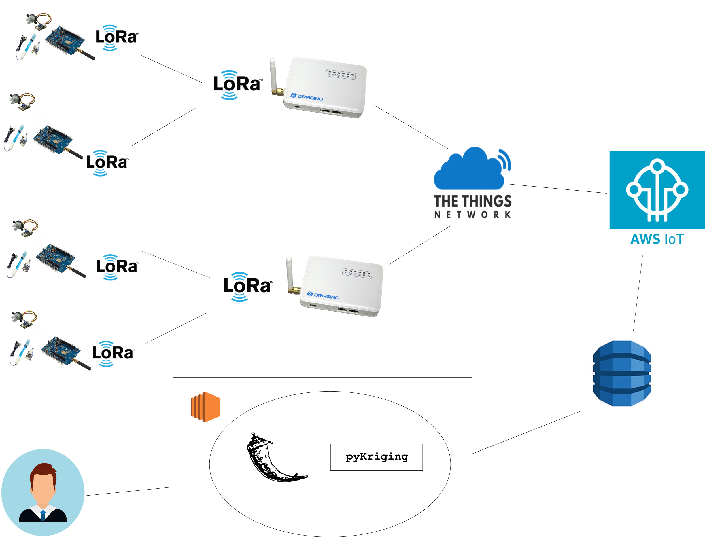

# HarbourWasteControl IoT 2021 - Technology
## Architecture
When the sensor nodes are deployed their geographical location are hardcoded in their firmware. The sensor node is composed of a  **ST B-L072Z-LRWAN1**, one **pH sensor**, one **Turbidity sensor** SKU SEN0189. The board will run **RIOT OS** used to make it as easy as possible the coding of network functionalities and sensor drivers. The nodes read the data coming from the sensors and send it to a gateway. The gateway then will send the data to the cloud.

For the cloud-based backend services, we use AWS. The data received is strored in a **DynamoDB** table, it is fetched periodically and then analyzed by applying a method of interpolationan called **Kriging**. The user has the possibility to view the result of the analysis analysis and the data collected from a dashboard. A **Flask** app running on an **AWS EC2** Instance will be responsible to run the analysis and the dashboard.

## Networking
The sensor node and the gateway comunicate via **LoRa**. The Lora gateway then sends the data to **TheThingsNewtork**, also known as TTN, then finally is sent to **AWS IoT**.

Lora classify end nodes in three differnet classes. The sensor nodes are considered Class A, battery powered sensor with no latency constraint, while the gateway is class C, because it can listen all the time for data.

## Components
- The **B-L072Z-LRWAN1** board is a 32-bit ARM based microcontroller.
- The **Turbidity sensor SKU SEN0189** measure the turbidity is the cloudiness or haziness of a fluid caused by large numbers of individual particles that are generally invisible to the naked eye, similar to smoke in air. The measurement of turbidity is a key test of water quality. The sensdor detects the water quality using light to detect suspended particles in water by measuring the light transmittance and scattering rate, which changes with the amount of total suspended solids (TSS) in water. The units of turbidity from a calibrated nephelometer are called Nephelometric Turbidity Units (NTU). Its power consume doesn't exceed 40mA.
- The **pH sensor** measure the pH, a scale used to specify the acidity or basicity of an aqueous solution. The pH of seawater is typically limited to a range between 7 and 8, and it plays an important role in the ocean's carbon cycle. The sensor works with a probe attached to the BNC connector, while the board must be connected using PH2.0 port. Its power consume doesn't exceed 10mA.

The sensor node components will be appropriately shielded by a waterproof enclousure to prevent damage by water, and in general by atmospheric phenomena.

#### Sources
1. https://wiki.dfrobot.com/Turbidity_sensor_SKU__SEN0189
2. https://wiki.dfrobot.com/PH_meter_SKU__SEN0161_
3. https://www.gazzettaufficiale.it/atto/serie_generale/caricaArticolo?art.progressivo=0&art.idArticolo=5&art.versione=1&art.codiceRedazionale=006G0171&art.dataPubblicazioneGazzetta=2006-04-14&art.idGruppo=54&art.idSottoArticolo1=10&art.idSottoArticolo=1&art.flagTipoArticolo=2
4. https://sensorex.com/ph-sensors-3/#comb-ph-tab
